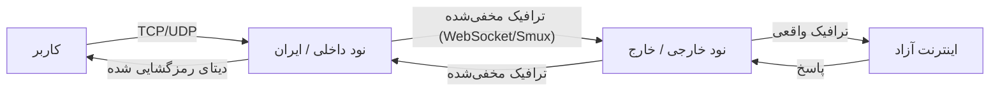

<div align="center" dir="rtl">
  

  <h1 style="margin-top: 20px;">Elahe Tunnel (تونل الهه)</h1>
  <p><strong>نسل جدید ابزارهای دور زدن فیلترینگ و مخفی‌سازی ترافیک (DPI Evasion)</strong></p>

  <p>
    <a href="https://golang.org/"></a>
    <a href="/LICENSE"></a>
    <a href="/VERSION"></a>
    <a href="#"></a>
    <a href="#"></a>
  </p>

  <p>
    <a href="./README.md"><strong>English</strong></a> |
    <a href="./README.fa.md"><strong>فارسی</strong></a>
  </p>
</div>

---

## 🚀 معرفی (Overview)

**Elahe Tunnel** یک ابزار پیشرفته، امن و با کارایی بالا برای ایجاد تونل و دور زدن سیستم‌های فیلترینگ و بازرسی عمیق بسته‌ها (DPI) است. این ابزار با مخفی‌سازی ترافیک (Obfuscation) در قالب درخواست‌های عادی وب (مانند جستجوی گوگل)، ترافیک شما را از دید فایروال‌ها پنهان می‌کند.

این سیستم با معماری کلاینت-سرور (نود داخلی و خارجی) طراحی شده تا ارتباطی پایدار و رمزنگاری‌شده را در شبکه‌های به شدت محدود شده فراهم کند.

## ✨ تکنولوژی‌ها و ویژگی‌های کلیدی (Technologies & Features)

این پروژه با استفاده از مدرن‌ترین تکنولوژی‌های شبکه و رمزنگاری توسعه داده شده است:

*   **زبان برنامه‌نویسی Go (Golang):** استفاده از Go برای دستیابی به بالاترین سطح همزمانی (Concurrency)، تاخیر پایین (Low Latency) و مصرف بهینه منابع سرور.
*   **مالتی‌پلکسینگ با Smux:** استفاده از کتابخانه `xtaci/smux` برای انتقال ده‌ها کانکشن TCP/UDP روی یک استریم واحد. این کار باعث کاهش چشمگیر Handshakeها و افزایش سرعت تونل می‌شود.
*   **انتقال بر بستر WebSocket:** استفاده از `gorilla/websocket` برای مخفی‌سازی ترافیک در قالب ترافیک استاندارد وب (HTTP/HTTPS) که شناسایی آن توسط DPI را بسیار دشوار می‌کند.
*   **تونل امن UDP با DTLS:** استفاده از `pion/dtls/v2` برای انتقال امن، سریع و بدون افت پکتِ ترافیک UDP (بسیار مناسب برای تماس‌های صوتی/تصویری، بازی‌های آنلاین و DNS).
*   **رمزنگاری نظامی (AES-256-GCM):** تمامی پکت‌ها پیش از ارسال با الگوریتم قدرتمند AES-GCM رمزنگاری می‌شوند تا امنیت و یکپارچگی داده‌ها تضمین شود.
*   **بارگذاری مجدد پویا (Dynamic Config Reload):** با استفاده از پوینترهای اتمیک (`atomic.Pointer`) در ساختار برنامه، می‌توانید فایل کانفیگ را تغییر داده و بدون نیاز به ری‌استارت کردن سرویس (Zero Downtime) تغییرات را اعمال کنید.
*   **مدیریت و مانیتورینگ:** دارای پنل وب داخلی و API برای مشاهده وضعیت کانکشن‌ها و قطع ارتباط‌های خاص (`/kill`).

## 🛠️ معماری سیستم (Architecture)

سیستم از دو بخش اصلی تشکیل شده است:

1.  **نود داخلی (Client):** در شبکه محدود شده (مثلاً ایران) قرار می‌گیرد. ترافیک کاربر را دریافت کرده، رمزنگاری و مخفی‌سازی می‌کند و به سرور خارج می‌فرستد.
2.  **نود خارجی (Server):** در شبکه آزاد (خارج از کشور) قرار دارد. ترافیک مخفی‌شده را دریافت، رمزگشایی و به اینترنت آزاد منتقل می‌کند و پاسخ را مجدداً مخفی کرده و برمی‌گرداند.



## 📦 نصب و راه‌اندازی (Installation)

برای نصب سریع و خودکار به همراه تمام پیش‌نیازها (از جمله Go)، دستور زیر را اجرا کنید:

```bash
bash <(curl -s -L https://raw.githubusercontent.com/ehsanking/elahe-tunnel/main/install.sh)
```

**کامپایل دستی (برای توسعه‌دهندگان):**
```bash
git clone https://github.com/ehsanking/elahe-tunnel.git
cd elahe-tunnel
go build -o elahe-tunnel main.go
```

## 🚦 نحوه استفاده (Usage)

پس از نصب، می‌توانید از طریق CLI برنامه را مدیریت کنید:

### ۱. پیکربندی اولیه (Setup)
ابتدا باید سرور و کلاینت را کانفیگ کنید. این دستور یک ویزارد تعاملی برای ساخت فایل `search_tunnel_config.json` اجرا می‌کند:
```bash
./elahe-tunnel setup
```
*(دقت کنید که کلید رمزنگاری یا `connection_key` باید در هر دو سرور ایران و خارج دقیقاً یکسان باشد).*

### ۲. اجرای سرویس (Run)
برای اجرای تونل در پس‌زمینه (Background):
```bash
./elahe-tunnel run
```

### ۳. مدیریت سرویس (Manage)
برای بررسی وضعیت اجرای سرویس یا متوقف کردن آن:
```bash
./elahe-tunnel status
./elahe-tunnel stop
```

### ۴. بارگذاری مجدد تنظیمات بدون قطعی (Dynamic Reload)
اگر فایل `search_tunnel_config.json` را به صورت دستی ویرایش کردید (مثلاً پورت جدیدی اضافه کردید)، نیازی به ری‌استارت سرویس نیست. کافیست API زیر را فراخوانی کنید تا تنظیمات به صورت آنی اعمال شوند:
```bash
curl -X POST http://127.0.0.1:8080/reload-config
```
*(پورت `8080` را با پورتی که در کانفیگ برای پنل وب یا تونل تنظیم کرده‌اید جایگزین کنید).*

## 🔧 ساختار فایل کانفیگ (Configuration)

تنظیمات در فایل `search_tunnel_config.json` ذخیره می‌شوند.

**نمونه کانفیگ سرور خارج (External Node):**
```json
{
  "node_type": "external",
  "tunnel_port": 443,
  "connection_key": "کلید_تولید_شده_توسط_setup",
  "web_panel_enabled": true,
  "web_panel_port": 8080,
  "web_panel_user": "admin",
  "web_panel_pass": "secure_password"
}
```

**نمونه کانفیگ سرور ایران (Internal Node):**
```json
{
  "node_type": "internal",
  "remote_host": "IP_سرور_خارج",
  "tunnel_port": 443,
  "connection_key": "کلید_تولید_شده_توسط_setup",
  "proxies": [
    {
      "name": "my-tcp-proxy",
      "type": "tcp",
      "local_ip": "127.0.0.1",
      "local_port": 1080,
      "remote_port": 1080
    }
  ]
}
```

## 🤝 مشارکت (Contributing)

ما از مشارکت شما استقبال می‌کنیم! برای افزودن ویژگی‌های جدید یا رفع باگ‌ها، لطفاً Pull Request ارسال کنید.

## ⚠️ سلب مسئولیت (Disclaimer)

این ابزار صرفاً جهت مقاصد آموزشی و تحقیقاتی برای بررسی روش‌های دور زدن فیلترینگ و سیستم‌های بازرسی عمیق بسته‌ها (DPI) توسعه داده شده است. توسعه‌دهندگان این پروژه هیچ‌گونه مسئولیتی در قبال استفاده نادرست یا غیرقانونی از این نرم‌افزار ندارند.

## 📜 لایسنس (License)

این پروژه تحت لایسنس MIT منتشر شده است. برای اطلاعات بیشتر فایل `LICENSE` را مطالعه کنید.

---
<div align="center">
  <sub>ساخته شده برای اینترنت آزاد.</sub>
</div>
