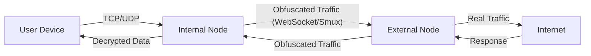

<div align="center">
  

  <h1 style="margin-top: 20px;">Elahe Tunnel</h1>
  <p><strong>Next-Gen Censorship Circumvention & Traffic Obfuscation</strong></p>

  <p>
    <a href="https://golang.org/"></a>
    <a href="/LICENSE"></a>
    <a href="/VERSION"></a>
    <a href="#"></a>
    <a href="#"></a>
  </p>

  <p>
    <a href="./README.md"><strong>English</strong></a> |
    <a href="./README.fa.md"><strong>فارسی</strong></a>
  </p>
</div>

---

## 🚀 Overview

**Elahe Tunnel** is an advanced, high-performance tunneling tool engineered to bypass sophisticated Deep Packet Inspection (DPI) systems. By camouflaging data packets to mimic legitimate Google Search queries and results, it renders traffic indistinguishable from normal web browsing.

Designed for resilience in restrictive network environments, it provides a secure, encrypted bridge between an internal node (e.g., inside a censored region) and an external node (with unrestricted internet access).

## ✨ Key Features & Technologies

*   **Go (Golang) Backend:** Built with Go for superior concurrency, low latency, and minimal resource footprint.
*   **Multiplexing with Smux:** Utilizes `xtaci/smux` to transport numerous TCP/UDP connections over a single stream, drastically reducing handshake overhead and boosting speed.
*   **WebSocket Transport:** Leverages `gorilla/websocket` to obfuscate traffic as standard web traffic (HTTP/HTTPS), making it extremely difficult for DPI systems to detect.
*   **Secure UDP Tunneling with DTLS:** Implements `pion/dtls/v2` for secure, fast, and packet-loss-resilient UDP transport, ideal for voice/video calls, gaming, and DNS.
*   **Military-Grade Encryption (AES-256-GCM):** All packets are encrypted with the powerful AES-GCM algorithm to ensure data confidentiality and integrity.
*   **Dynamic Config Reload:** With `atomic.Pointer`, the configuration file can be modified and reloaded without any service downtime via the `/reload-config` API endpoint.
*   **Real-Time Monitoring:** Features a built-in web dashboard and API for monitoring active connections and killing specific streams (`/kill`).

## 🛠️ Architecture

The system operates on a client-server model:

1.  **Internal Node (Client):** Located within the restricted network. It accepts local traffic, encrypts it, wraps it in a fake Google Search query, and sends it to the external node.
2.  **External Node (Server):** Located in an unrestricted network. It receives the "search query," unwraps and decrypts the payload, forwards it to the destination, and returns the response wrapped in a fake Google Search results page.



## 📦 Installation

Install and configure Elahe Tunnel with a single command. This script handles dependencies (Go) and setup automatically.

```bash
bash <(curl -s -L https://raw.githubusercontent.com/ehsanking/elahe-tunnel/main/install.sh)
```

**Manual Compilation (for developers):**
```bash
git clone https://github.com/ehsanking/elahe-tunnel.git
cd elahe-tunnel
go build -o elahe-tunnel main.go
```

## 🚦 Usage

Once installed, manage the tunnel using the `elahe-tunnel` CLI:

### 1. Setup
Configure your node as either **Internal** (Client) or **External** (Server). This command launches an interactive wizard to create the `search_tunnel_config.json` file.
```bash
./elahe-tunnel setup
```
*(Ensure the `connection_key` is identical on both the internal and external nodes).*

### 2. Run
Start the tunnel service in the background.
```bash
./elahe-tunnel run
```

### 3. Manage
Check status or stop the background service.
```bash
./elahe-tunnel status
./elahe-tunnel stop
```

### 4. Dynamic Reload
If you manually edit `search_tunnel_config.json`, you can apply the changes without restarting the service by calling the reload API:
```bash
curl -X POST http://127.0.0.1:8080/reload-config
```
*(Replace `8080` with the port you configured for the web panel or tunnel).*

## 🔧 Configuration

Configuration is stored in `search_tunnel_config.json`.

**Example `search_tunnel_config.json` for an External Node:**
```json
{
  "node_type": "external",
  "tunnel_port": 443,
  "connection_key": "YOUR_GENERATED_KEY",
  "web_panel_enabled": true,
  "web_panel_port": 8080,
  "web_panel_user": "admin",
  "web_panel_pass": "your_secure_password"
}
```

**Example `search_tunnel_config.json` for an Internal Node:**
```json
{
  "node_type": "internal",
  "remote_host": "YOUR_SERVER_IP",
  "tunnel_port": 443,
  "connection_key": "YOUR_GENERATED_KEY",
  "proxies": [
    {
      "name": "my-tcp-proxy",
      "type": "tcp",
      "local_ip": "127.0.0.1",
      "local_port": 1080,
      "remote_port": 1080
    }
  ]
}
```

## 🤝 Contributing

Contributions are welcome! Please feel free to submit a Pull Request.

## ⚠️ Disclaimer

This tool is intended for educational and research purposes only, specifically to demonstrate how censorship circumvention and traffic obfuscation techniques work. The developers of this project are not responsible for any misuse of this software.

## 📜 License

Distributed under the MIT License. See `LICENSE` for more information.

---
<div align="center">
  <sub>Built with ❤️ for internet freedom.</sub>
</div>
