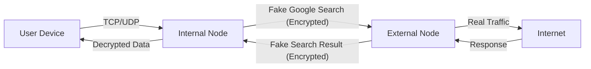

<div align="center">
  

  <h1 style="margin-top: 20px;">Elahe Tunnel</h1>
  <p><strong>Next-Gen Censorship Circumvention & Traffic Obfuscation</strong></p>

  <p>
    <a href="https://golang.org/"></a>
    <a href="/LICENSE"></a>
    <a href="/VERSION"></a>
    <a href="#"></a>
    <a href="#"></a>
  </p>
</div>

---

## 🚀 Overview

**Elahe Tunnel** is an advanced, high-performance tunneling tool engineered to bypass sophisticated Deep Packet Inspection (DPI) systems. By camouflaging data packets to mimic legitimate Google Search queries and results, it renders traffic indistinguishable from normal web browsing.

Designed for resilience in restrictive network environments, it provides a secure, encrypted bridge between an internal node (e.g., inside a censored region) and an external node (with unrestricted internet access).

## ✨ Key Features

*   **🕵️ Advanced Obfuscation:** Encapsulates traffic within HTTP GET/POST requests that perfectly mimic Google Search patterns, fooling heuristic analysis.
*   **🔒 Military-Grade Encryption:** All data is secured with **AES-256-GCM** encryption, ensuring confidentiality and integrity.
*   **⚡ High Performance:** Built with Go for superior concurrency, low latency, and minimal resource footprint.
*   **📊 Real-Time Web Dashboard:** Monitor traffic, active connections, and system health via a modern, responsive web interface.
*   **🌐 Multi-Protocol Support:**
    *   **TCP:** Robust tunneling for standard web traffic.
    *   **UDP (DTLS):** Secure, low-latency transport for voice/video calls and gaming.
    *   **DNS:** Encrypted DNS proxy to prevent DNS poisoning and leakage.
*   **🛠️ Easy Deployment:** Single-command installation and interactive setup wizard.

## 🛠️ Architecture

The system operates on a client-server model:

1.  **Internal Node (Client):** Located within the restricted network. It accepts local traffic, encrypts it, wraps it in a fake Google Search query, and sends it to the external node.
2.  **External Node (Server):** Located in an unrestricted network. It receives the "search query," unwraps and decrypts the payload, forwards it to the destination, and returns the response wrapped in a fake Google Search results page.



## 📦 Installation

Install and configure Elahe Tunnel with a single command. This script handles dependencies (Go) and setup automatically.

```bash
bash <(curl -s -L https://raw.githubusercontent.com/ehsanking/elahe-tunnel/main/install.sh)
```

## 🚦 Usage

Once installed, manage the tunnel using the `elahe-tunnel` CLI:

### 1. Setup
Configure your node as either **Internal** (Client) or **External** (Server).
```bash
elahe-tunnel setup
```

### 2. Run
Start the tunnel service in the background.
```bash
elahe-tunnel run
```

### 3. Manage
Check status or stop the background service.
```bash
elahe-tunnel status
elahe-tunnel stop
```

### 4. Monitor
Access the web dashboard at `http://YOUR_IP:8080` (default port) to view real-time statistics.
Login with the credentials set during setup.

## 🔧 Configuration

Configuration is stored in `search_tunnel_config.json`. While the `setup` command handles initial configuration, you can manually edit this file to fine-tune settings, such as enabling the web panel.

**Example `search_tunnel_config.json` for an Internal Node:**
```json
{
  "node_type": "internal",
  "remote_host": "YOUR_SERVER_IP",
  "connection_key": "YOUR_SHARED_SECRET_KEY",
  "web_panel_enabled": true,
  "web_panel_port": 8080,
  "web_panel_user": "admin",
  "web_panel_pass": "your_secure_password"
}
```

Below is a description of the key configuration options:

| Key | Description |
| :--- | :--- |
| `node_type` | `internal` or `external` |
| `remote_host` | IP/Domain of the external server |
| `connection_key` | Base64 encoded AES-256 key (must match on both nodes) |
| `web_panel_enabled` | Enable/Disable the web dashboard |
| `web_panel_port` | Port for the web dashboard |

## 🤝 Contributing

Contributions are welcome! Please feel free to submit a Pull Request.

1.  Fork the repository
2.  Create your feature branch (`git checkout -b feature/AmazingFeature`)
3.  Commit your changes (`git commit -m 'Add some AmazingFeature'`)
4.  Push to the branch (`git push origin feature/AmazingFeature`)
5.  Open a Pull Request

## ⚠️ Disclaimer

This tool is intended for educational and research purposes only, specifically to demonstrate how censorship circumvention and traffic obfuscation techniques work. The developers of this project are not responsible for any misuse of this software.

By using this software, you agree to comply with all applicable local, national, and international laws and regulations. You are solely responsible for ensuring that your use of this tool does not violate any laws or terms of service of any network or service provider.

This software is provided "as is", without warranty of any kind, express or implied.

## 📜 License

Distributed under the MIT License. See `LICENSE` for more information.

---
<div align="center">
  <sub>Built with ❤️ for internet freedom.</sub>
</div>
